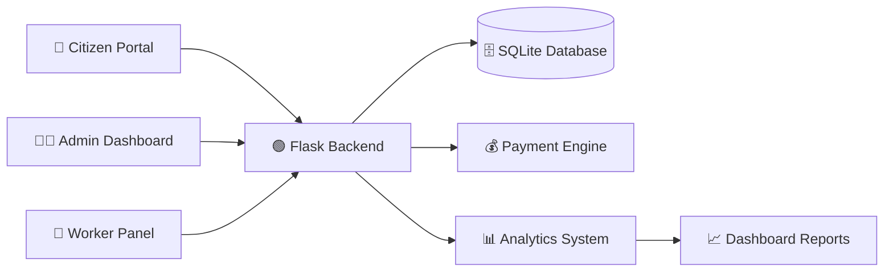

<div align="center">

# ♻️ GreenCycle Nexus

### Smart Waste Management & Civic Automation Platform


<br>


</div>

---

<p align="center">
  
</p>

---

# 🧠 Overview

GreenCycle Nexus is a modern civic waste management platform designed to digitize and automate waste collection workflows using a role-based system architecture.

The platform simulates a real-world government-style infrastructure where citizens can log waste, administrators can approve collection requests, and workers can manage pickup operations efficiently.

The system focuses on:
- ♻️ Waste management automation
- 🏛 Civic workflow digitization
- 📊 Analytics and monitoring
- 💰 Automated payment systems
- 🚛 Smart pickup scheduling
- 👥 Multi-role access management

GreenCycle Nexus aims to modernize traditional waste management operations using scalable digital systems and intelligent workflow automation.

---

# 🌍 Real World Problem

Traditional waste management systems often face:

```text
• Manual paperwork
• Delayed approvals
• Poor collection tracking
• Inefficient scheduling
• Lack of transparency
• Weak communication systems
• Unorganized payment processes
```

Most local civic systems still rely heavily on manual coordination, which leads to:
- operational inefficiencies
- delayed collections
- poor accountability
- citizen dissatisfaction

GreenCycle Nexus solves these challenges through a centralized digital workflow platform.

---

# 🎯 Mission

> Build a scalable digital civic infrastructure that simplifies waste collection, approval workflows, and operational management through intelligent automation systems.

---

# 💡 Vision

The long-term vision of GreenCycle Nexus is to create:

```text
✔ Smart waste collection ecosystems
✔ Automated civic workflows
✔ Real-time operational monitoring
✔ Digital municipal infrastructure
✔ Scalable sustainability platforms
✔ Data-driven environmental management
```

---

# 🚀 Core Features

<div align="center">

| Feature | Description |
|---|---|
| 👥 Multi-Role System | Separate dashboards for Admin, Citizen, and Worker |
| ♻️ Waste Logging | Citizens can submit waste collection requests |
| ✅ Approval Workflow | Admins review and approve waste requests |
| 💰 Automated Payments | System automatically calculates collection charges |
| 🚛 Pickup Scheduling | Workers receive scheduled pickup tasks |
| 📊 Analytics Dashboard | Visual monitoring of waste statistics |
| 🌙 Theme System | Light/Dark mode support |
| 🔐 Authentication | Secure bearer-token authorization |

</div>

---

# 🏗️ System Architecture

<div align="center">



</div>

---

# 🛠️ Technology Stack

---

## 🐍 Backend — Flask

The backend system handles workflow logic, APIs, authentication, and operational management.

### Features

```text
✔ REST API Architecture
✔ Authentication Management
✔ Workflow Automation
✔ Waste Processing Logic
✔ Payment Calculation Engine
✔ Role-Based Access Control
```

---

## 🌐 Frontend — HTML/CSS/JavaScript

The frontend provides a responsive and interactive single-page application experience.

### Features

```text
✔ Dynamic Dashboard UI
✔ Responsive Design
✔ Interactive Workflow Panels
✔ Real-Time User Interaction
✔ Theme Switching
✔ Smooth User Experience
```

---

## 🗄 Database — SQLite

SQLite stores system data, waste records, schedules, users, and payment history.

### Features

```text
✔ Lightweight Architecture
✔ Fast Local Storage
✔ Structured Data Management
✔ Efficient Query Performance
✔ Reliable Data Persistence
```

---

# 📂 Project Structure

```bash
greencycle-nexus/
│
├── backend/
│   ├── app/
│   │   ├── __init__.py
│   │   ├── models.py
│   │   ├── routes.py
│   │   ├── auth.py
│   │   ├── services.py
│   │   └── analytics.py
│   │
│   ├── requirements.txt
│   └── run.py
│
├── frontend/
│   ├── app.html
│   ├── styles.css
│   ├── script.js
│   └── assets/
│
├── docs/
├── screenshots/
├── README.md
└── LICENSE
```

---

# 👥 User Roles

---

## 👨‍💼 Admin

The administrator manages the entire waste collection workflow.

### Capabilities

```text
✔ Approve waste requests
✔ Monitor pending submissions
✔ Analyze waste statistics
✔ Track payment generation
✔ Manage operational workflows
✔ Monitor collection performance
```

---

## 👤 Citizen

Citizens can submit waste collection requests and monitor activity.

### Capabilities

```text
✔ Submit waste details
✔ Track approval status
✔ View payment history
✔ Check pickup schedules
✔ Monitor collection records
```

---

## 🚛 Worker

Workers handle collection operations and pickup management.

### Capabilities

```text
✔ View assigned pickups
✔ Track collection schedules
✔ Update collection status
✔ Mark waste as collected
✔ Monitor task completion
```

---

# 💰 Waste Pricing System

The platform automatically calculates waste management costs.

<div align="center">

| Waste Type | Price |
|---|---|
| 🍎 Food Waste | ₹2 / kg |
| 🧴 Plastic Waste | ₹3 / kg |
| 📦 Other Waste | ₹1 / kg |

</div>

---

# 🔄 Workflow System

```text
Citizen logs waste
        ↓
Admin reviews request
        ↓
System generates payment
        ↓
Worker receives pickup task
        ↓
Collection completed
```

---

# 🔗 API Endpoints

```text
POST   /register              → Register user
POST   /login                 → Login system
POST   /waste                 → Submit waste request
GET    /history/:user_id      → Fetch user history
GET    /pending               → Pending approvals
POST   /approve/:id           → Approve waste request
GET    /payments/:user_id     → Payment details
GET    /schedule/:user_id     → Pickup schedules
GET    /pickups/:worker_id    → Worker assignments
POST   /collect/:id           → Mark collection complete
```

---

# 📊 Dashboard Analytics

The analytics system helps monitor operational efficiency using:

```text
✔ Waste type distribution
✔ Approval rate tracking
✔ Collection analytics
✔ Payment monitoring
✔ Operational reports
✔ Worker activity tracking
✔ Civic workflow statistics
```

---

# 🚀 Development Roadmap

## 🟢 Phase 1 — Core System

```text
✔ Waste logging
✔ Approval workflows
✔ Payment automation
✔ Pickup scheduling
✔ Role-based authentication
✔ Dashboard system
```

---

## 🟡 Phase 2 — Advanced Features

```text
✔ Data filtering
✔ Export functionality
✔ Timeline analytics
✔ Advanced reporting
✔ Improved dashboards
✔ Notification systems
```

---

## 🔴 Phase 3 — Smart Civic Infrastructure

```text
✔ Cloud deployment
✔ OTP authentication
✔ AI waste analytics
✔ IoT integration
✔ Smart collection systems
✔ Municipal scalability
```

---

# ⚙️ Installation & Setup

---

# 🐍 Backend Setup

```powershell
cd greencycle-nexus\backend

python -m venv .venv

.\.venv\Scripts\activate

pip install -r requirements.txt

python run.py
```

---

# 🌐 Frontend Setup

## Option 1

```text
Open app.html directly in browser
```

---

## Option 2

```bash
cd ..

python -m http.server 5500
```

Open:

```text
http://127.0.0.1:5500/app.html
```

---

# 👥 Demo Accounts

```text
👨‍💼 Admin
Phone: 9000000001
PIN: 1111

👤 Citizen
Phone: 9000000002
PIN: 2222

🚛 Worker
Phone: 9000000003
PIN: 3333
```

---

# 🌍 Target Use Cases

```text
✔ Municipal waste systems
✔ Smart city projects
✔ Civic management platforms
✔ Environmental monitoring
✔ Digital governance systems
✔ Sustainable urban infrastructure
```

---

# 🔥 Highlights

```text
✔ Full backend + frontend integration
✔ Role-based workflow management
✔ Automated payment logic
✔ Real-world civic simulation
✔ Scalable project architecture
✔ Sustainable technology concept
```

---

# 💡 Future Improvements

```text
🚀 Cloud deployment
🚀 OTP authentication
🚀 Payment gateway integration
🚀 Smart waste analytics
🚀 IoT sensor integration
🚀 Mobile application support
🚀 AI-based operational analysis
🚀 Smart city integrations
```

---

# 💣 One-Line Summary

> A modern role-based waste management platform that automates logging, approval, payment, and collection workflows through scalable civic infrastructure systems.

---

# 👨‍💻 Author

<div align="center">

## Muhammed Salman N

Full Stack Developer

🐍 Python  
🟢 Flask  
🌐 JavaScript  
🗄 SQLite

### Interests

```text
• Full Stack Development
• Civic Technology
• Smart Systems
• Sustainability Platforms
• Workflow Automation
• Scalable Architectures
```

<a href="https://github.com/mav8stro">
  
</a>

</div>

---

# 📈 GitHub Analytics

<div align="center">


</div>

---

# 🔥 Contribution Graph

<div align="center">


</div>

---

# 📄 License

```text
MIT License
```

---

<div align="center">


</div>
